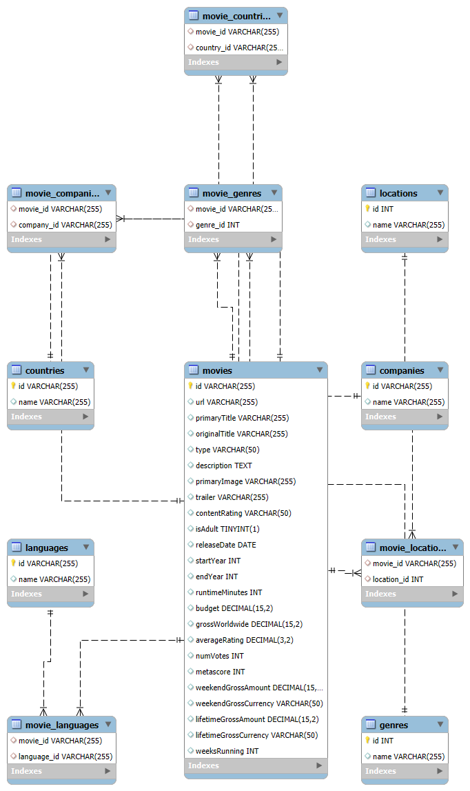

# PreditorDeSucessoIMDB

PreditorDeSucessoIMDB é uma aplicação para predição de sucesso de filmes usando dados do IMDB. O projeto inclui:

- API REST para consulta de dados de filmes armazenados em MySQL.
- Endpoint de predição da probabilidade de sucesso de um filme baseado em modelo de Random Forest Classifier.
- Notebooks para coleta de dados via IMDB API (RapidAPI), análise exploratória e engenharia de features.
- Armazenamento, processamento e visualização de dados em dashboard.

---

## Requisitos do Projeto

1. Identificar uma API de interesse da equipe que tenha dados passíveis de análise e predição.
2. Consumir a API gerando tabelas de dados em memória.
3. Processar esses dados aplicando filtros, totalizadores etc.
4. A partir dos dados filtrados, armazenar em um Banco de Dados SQL.
5. Desenvolver um Dashboard para apresentar os dados.
6. Aplicar técnicas de IA para fazer predição de dados.
7. Desenvolver uma API para consumir os dados tratados e totalizados.

---

## Estrutura do Projeto

```
/
├── api/                  # Código da API FastAPI e script de cliente
│   ├── api.py           # Endpoints da aplicação (movies, genres, stats, predict)
│   ├── popular_sql.py   # Consultas SQL populares para referência
│   └── predict.py       # Script de exemplo para chamar o endpoint /predict
├── dados/               # Dados originais em Excel, obtidos via API do IMDB (RapidAPI) pelo notebook API_IMDB_Requests.ipynb
│   └── movies_data.xlsx # Planilha com informações de filmes
├── dump/                # Arquivos SQL para criar e popular o banco de dados
│   ├── IMDB_movies.sql
│   ├── IMDB_genres.sql
│   ├── IMDB_movie_genres.sql
│   └── ... (demais tabelas e relacionamentos)
├── notebooks/           # Análises exploratórias e peças de código para a API
│   ├── API_IMDB_Analise_e_Modelo.ipynb  # Notebook de análise e treino de modelo
│   └── API_IMDB_Requests.ipynb          # Notebook de coleta de dados via IMDB API (RapidAPI) e salvamento em Excel
├── models/              # Modelos serializados (Random Forest Classifier)
│   └── model.joblib     # Modelo treinado
├── requirements.txt     # Dependências Python
└── README.md            # Documentação do projeto (este arquivo)
```

---

## Pré-requisitos

- Python 3.7+
- MySQL Server (ou compatível) instalado e em execução
- Acesso ao terminal (bash, PowerShell, etc.)

---

## Instalação

1. Clone este repositório:

   ```bash
   git clone <URL_DO_REPOSITORIO>
   cd <PASTA_DO_PROJETO>
   ```
2. Crie e ative um ambiente virtual (opcional, mas recomendado):

   ```bash
   python -m venv venv
   source venv/bin/activate  # Linux/macOS
   venv\Scripts\activate     # Windows PowerShell
   ```
3. Instale as dependências:

   ```bash
   pip install --upgrade pip
   pip install -r requirements.txt
   ```

---

## Configuração do Banco de Dados

1. Crie um banco de dados MySQL chamado `IMDB` (ou outro nome de sua preferência, ajustando `DB_CONFIG` em `api/api.py`).
2. Execute os scripts SQL disponíveis em `dump/` para criar as tabelas e popular os dados:

   ```bash
   mysql -u root -p IMDB < dump/IMDB_movies.sql
   mysql -u root -p IMDB < dump/IMDB_genres.sql
   mysql -u root -p IMDB < dump/IMDB_movie_genres.sql
   # Repita para os demais arquivos .sql em dump/
   ```
3. Ajuste as credenciais de acesso (usuário, senha, host, porta) no dicionário `DB_CONFIG` em `api/api.py`, se necessário.

---

## Diagrama do Banco de Dados



---

## Executando a API

Inicie o servidor FastAPI com o Uvicorn:

```bash
uvicorn api.api:app --reload --host 0.0.0.0 --port 8000
```

A API estará disponível em `http://localhost:8000`.

Para documentação interativa via Swagger UI, acesse:

```
http://localhost:8000/docs
```

---

## Endpoints Principais

### Filmes

- **GET** `/movies?limit={n}&offset={m}`

  - Lista filmes paginados. Parâmetros opcionais `limit` (padrão 10) e `offset` (padrão 0).
- **GET** `/movies/{movie_id}`

  - Retorna detalhes completos de um filme, incluindo gêneros, idiomas, países, produtoras e locações.

### Predição de Sucesso

- **POST** `/predict`
  - Recebe JSON com informações do filme e retorna probabilidade de sucesso em porcentagem.
  - Corpo de exemplo:
    ```json
    {
      "runtimeMinutes": 120,
      "budget": 100000,
      "genres": ["Comedy"],
      "production_companies": ["co0000001"],
      "languages": ["en"],
      "countries": ["US"],
      "rating": "PG-13",
      "loc": "US"
    }
    ```

### Gêneros, Idiomas, Países, Produtoras, Locações

- **GET** `/genres`, `/languages`, `/countries`, `/companies`, `/locations`

  - Retorna listas de entidades.
- **GET** `/{entity}/{id}/movies` (por exemplo `/genres/1/movies`)

  - Lista filmes relacionados a um gênero, idioma, país, produtora ou locação específica.

### Estatísticas

- **GET** `/stats/genres/top?limit={n}`

  - Top N gêneros mais frequentes.
- **GET** `/stats/yearly/count?start={ano}&end={ano}`

  - Contagem anual de filmes entre anos especificados.

---

## Cliente de Exemplo

O script `api/predict.py` demonstra como enviar requisições ao endpoint `/predict`:

```bash
python api/predict.py
```

---

## Análises e Treinamento

Os notebooks em `notebooks/` contêm:

- `API_IMDB_Analise_e_Modelo.ipynb`: notebook de análise exploratória, engenharia de features e treino do modelo `model.joblib` (Random Forest Classifier), incluindo:
    - Carregamento e limpeza dos dados a partir de `dados/movies_data.xlsx` (remoção de duplicados e formatação de colunas complexas).
    - Conversão hashable para colunas com estruturas complexas e parsing de listas/dicionários.
    - One-hot encoding de variáveis multivaloradas (gêneros, idiomas, locações, produtoras).
    - Seleção de features com base em variância para descartar colunas de baixa informação.
    - Definição da variável alvo binária de sucesso com base em `averageRating` e `numVotes`.
    - Divisão dos dados em conjuntos de treinamento e teste.
    - Treino e avaliação de um RandomForestClassifier (acurácia, relatório de classificação).
    - Análise das importâncias das features e visualização.
    - Salvamento do modelo final em `models/model.joblib`.
    - Experimentos de sensibilidade variando valores de features para otimização da probabilidade.

- `API_IMDB_Requests.ipynb`: coleta de dados via API do IMDB (RapidAPI) e salvamento em Excel.
- Para regenerar ou ajustar o modelo, basta executar as células de treino no Jupyter Notebook e salvar o modelo atualizado em `models/model.joblib`.

---

## Possíveis Melhorias

- Adicionar testes automatizados (unitários e de integração).
- Implementar autenticação/autorização na API.
- Containerizar a aplicação usando Docker.

---

## Contribuição

Contribuições são bem-vindas! Faça um fork, crie uma branch com sua feature ou correção e abra um pull request.

---

## Licença

Este projeto está sob a licença MIT. See [LICENSE](LICENSE) para mais detalhes.
